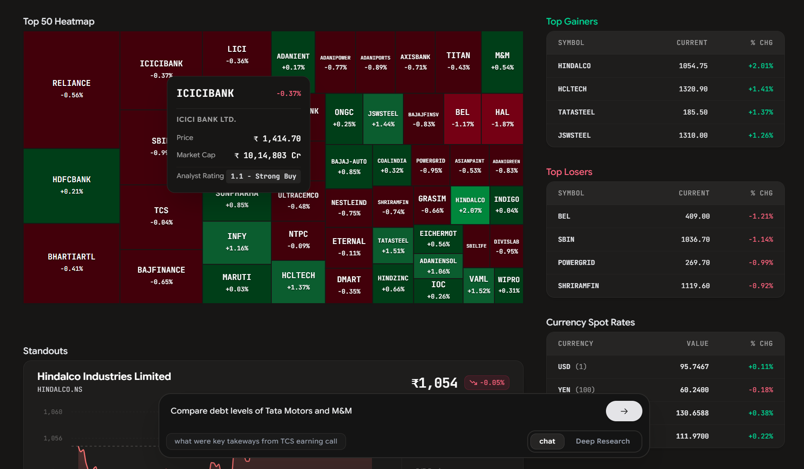

# AI Financial Research Agent

A financial agent that analyzes Indian stocks using the latest news, financial ratios, fundamental and technical data, company performance, and earnings call transcripts, delivering as real-time, streamed research reports.

---

## System Architecture


---

**Dashboard:**


---

**Flow:**

1. A user query is pushed onto a **Query Queue** and read by the agent.
2. A relevance/triage step determines if the query is in-scope (Indian equities); out-of-scope queries end immediately.
3. The **Orchestrator** decomposes the query and routes it across four domain subagents and a set of direct-call tools, calling only what the query actually needs:
   - **Fundamental Subagent** — balance sheet, income statement, cash flow, stock info, and its own calculator access for derived ratios (e.g. current ratio, YoY growth).
   - **Technical Subagent** — price history and corporate-action data, with its own calculator access for derived indicators (e.g. moving averages).
   - **Sentiment Subagent** — recent news, for a grounded bullish/bearish/mixed read.
   - **Direct tools** — earnings call transcript summaries, index performance, shareholding pattern, top movers, and peer comparison, called directly by the orchestrator where no multi-step reasoning or derived computation is needed.
4. The **Report Generator** synthesizes subagent and tool outputs into a final, formatted response, streamed live to the user using **Redis Pub/Sub** and **Server-Sent Event**.
5. Every query and generated report is persisted in **PostgreSQL** for historical chat/report retrieval.

---

## Evaluation

Correctness and reliability are tracked with a [DeepEval](https://deepeval.com/) harness run against a held-out set of equity-analysis queries spanning fundamental, technical, and multi-company comparison questions, scored via LLM-as-judge.

| Metric               | Average Score | Pass Rate |
| -------------------- | ------------- | --------- |
| Correctness (G-Eval) | 0.81          | 85%       |
| Task Completion      | 0.92          | 95%       |

---

## Tech Stack

**Backend** — Bun · Express · LangChain / LangGraph (multi-agent orchestration) · BullMQ + Redis (queueing, pub/sub, scheduling) · Prisma + PostgreSQL (Supabase) · Mistral / Gemini / Groq / OpenAI /· yahoo-finance2 + NSE client

**Frontend** — React 19 · Vite · TailwindCSS v4 · shadcn/ui · Zustand · TanStack Query · Recharts · Framer Motion

---

## Getting Started

**Backend**

```bash
bun install
bun run dev      # start the API server
bun run worker    # start the BullMQ worker
```

**Frontend**

```bash
npm install
npm run dev
```

> Requires environment variables for `GOOGLE_API_KEY`, `MISTRAL_TOKEN`, `GROQ_API_KEY`, Redis, and database connection strings — see `.env.example` (to be added).

---
