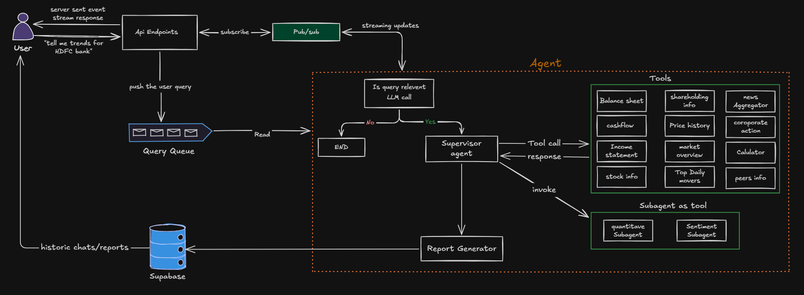

# AI Financial Research Agent

An autonomous, multi-agent research system that turns a plain-language question ("tell me trends for HDFC Bank") into a grounded, data-backed financial report streamed to the user in real time and persisted for future recall.

Unlike single shot LLM wrappers around a search API, this project is built as a **supervised multi-agent pipeline** with dedicated subagents, a curated tool registry over live Indian market data (NSE + Yahoo Finance), and an async, queue-driven execution model designed to scale independently of request volume.

---

## System Architecture



## Why this project is different

- **Supervisor + subagent architecture, not a single mega-prompt.** A lightweight relevance-check gates every query before any tool call is made. A supervisor agent orchestrates tool use and delegates specialized reasoning quantitative metric derivation and news/sentiment synthesis to dedicated subagents.

- **India-first market data.** Purpose-built tools around NSE data (shareholding patterns, peer comparisons, corporate actions, top movers, sectoral index performance) alongside Yahoo Finance fundamentals data most generic AI finance agents don't surface well.
- **Real-time streaming, decoupled from compute.** Requests are queued (BullMQ) rather than handled synchronously, so report generation never blocks the API layer. Progress and token-level output are pushed through Redis Pub/Sub and delivered to the client over Server-Sent Events.
- **Scheduled autonomous reporting.** A recurring job independently generates and caches a market-wide summary (NIFTY, Sensex, Bank Nifty) without any user request in the loop.

---

**Flow summary:**

1. User submits a query via the API; it's pushed onto a BullMQ query queue rather than processed inline.
2. A worker picks up the job and runs the LangGraph agent.
3. A relevance-check node filters out-of-scope queries early, before any tool cost is incurred.
4. The **Supervisor Agent** (Mistral) interprets the query, resolves company → ticker symbol mappings, and orchestrates calls across the tool registry — including invoking the Quantitative and Sentiment subagents as tools for specialized reasoning.
5. The **Report Generator** (Gemini) synthesizes all gathered tool evidence into a final, query-type-aware response (brief / detailed / market summary).
6. Progress events and streamed tokens are published to Redis Pub/Sub and relayed to the client over SSE.
7. The final report, along with tool evidence and usage metadata, is persisted to Supabase for historic recall.

---

## Tech Stack

**Backend** — Bun · Express · LangChain / LangGraph (multi-agent orchestration) · BullMQ + Redis (queueing, pub/sub, scheduling) · Prisma + PostgreSQL (Supabase) · Mistral / Gemini / Groq / OpenAI /· yahoo-finance2 + NSE client

**Frontend** — React 19 · Vite · TailwindCSS v4 · shadcn/ui · Zustand · TanStack Query · Recharts · Framer Motion

---

## Getting Started

**Backend**

```bash
bun install
bun run dev      # start the API server
bun run worker    # start the BullMQ worker
bun run agent      # run the agent standalone (dev/debug)
```

**Frontend**

```bash
npm install
npm run dev
```

> Requires environment variables for `GOOGLE_API_KEY`, `MISTRAL_TOKEN`, `GROQ_API_KEY`, Redis, and database connection strings — see `.env.example` (to be added).

---

_This README is a working draft intended to be refined before public release — update the project name, add licensing, and fill in setup/env details as the project stabilizes._
